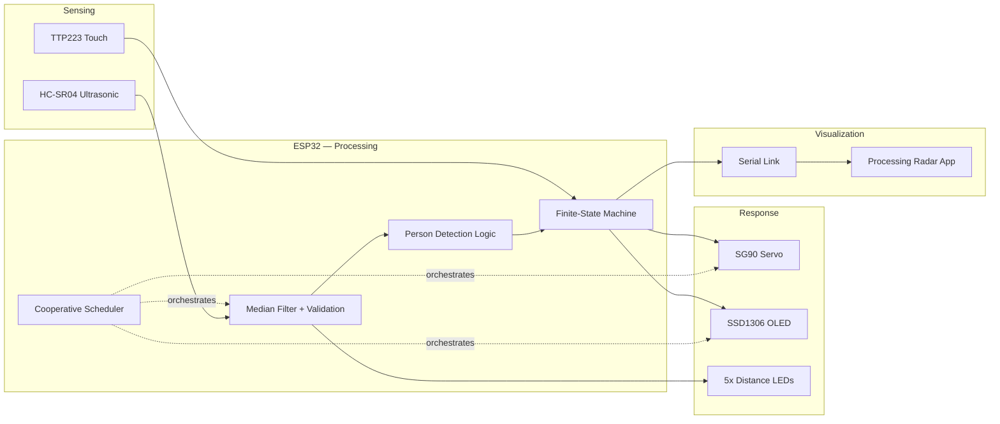
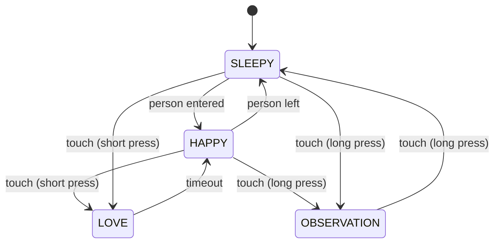
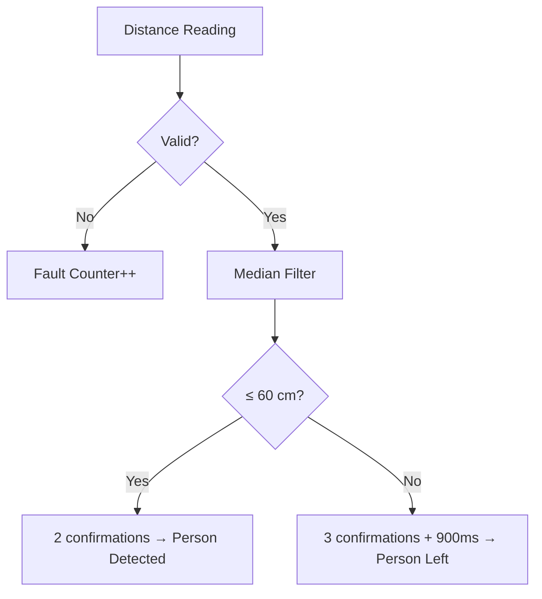

# EVA — ESP32-Based Interactive Robotic Head

[](#)
[-00979D)](#)
[](#)
[](#license)
[](#)

> An embedded systems project combining real-time sensing, signal filtering, event-driven behaviour, servo control, OLED graphics, and PC-side radar visualization — all running on a single ESP32 with a cooperative non-blocking scheduler.

<p align="center">
  

</p>

---

## Table of contents

- [Overview](#overview)
- [Demo](#demo)
- [Features](#features)
- [System architecture](#system-architecture)
- [Hardware](#hardware)
- [Firmware architecture](#firmware-architecture)
- [Core algorithms](#core-algorithms)
- [Operating modes](#operating-modes)
- [Radar visualization (Processing)](#radar-visualization-processing)
- [Bonus: phone Wi-Fi control](#bonus-phone-wi-fi-control)
- [Repository structure](#repository-structure)
- [Getting started](#getting-started)
- [Testing & validation](#testing--validation)
- [Skills demonstrated](#skills-demonstrated)
- [References](#references)
- [License](#license)

---

## Overview

EVA is an ESP32-based interactive robotic head that fuses **sensing → processing → response → visualization** into one embedded system:

- **HC-SR04** ultrasonic sensor for distance measurement
- **TTP223** capacitive touch sensor for interaction
- **SSD1306 OLED** for expressions and live status
- **SG90 servo** for head movement / environment scanning
- **5× LEDs** for at-a-glance distance indication
- A **Processing (Java)** desktop app for real-time radar visualization
- A **Wi-Fi prototype** for phone-based remote control

The firmware is built around a **finite-state behavioural model** and a **cooperative, non-blocking scheduler** — not a chain of `delay()` calls — so sensing, movement, display updates, and telemetry all run concurrently on a single core.

## Demo

## Demo

<table>
  <tr>
    <th>Normal Mode</th>
    <th>Observation Mode</th>
    <th>Radar Visualization</th>
    <th>Wi-Fi Control</th>
  </tr>
  <tr>
    <td align="center">
      
    </td>
    <td align="center">
      
    </td>
    <td align="center">
      
    </td>
    <td align="center">
      
    </td>
  </tr>
</table>

## Features

- Interrupt-based ultrasonic echo timing (no blocking `pulseIn`)
- 5-sample median filtering with valid-range rejection (3–200 cm)
- Confirmation-based person detection (debounced entry/exit logic)
- Cooperative, priority-free task scheduler (touch/servo/OLED/sensor/radar run at independent periods)
- Ring-buffer event queue driving a 4-state behavioural FSM
- Animated OLED expressions (sleepy, happy, love) + live diagnostics screen
- Servo-driven 180° environmental scan with serial telemetry
- Real-time radar rendering in Processing from live serial data
- Standalone Wi-Fi access-point prototype for phone-based remote control

## System architecture



## Hardware

### Bill of materials

| Component | Interface | ESP32 Pin |
|---|---|---|
| SSD1306 OLED (128×64, I²C, addr `0x3C`) | I²C | SDA 21 • SCL 22 |
| HC-SR04 Ultrasonic Sensor | Digital | TRIG 5 • ECHO 23 (via voltage divider) |
| TTP223 Touch Sensor | Digital | GPIO 4 |
| SG90 Servo Motor | PWM @ 50 Hz | GPIO 19 |
| 5× Distance LEDs (220 Ω series) | Digital | 13, 12, 14, 26, 25 |

### Power architecture

| Rail | Used by |
|---|---|
| 3.3 V | SSD1306 OLED, TTP223 touch sensor |
| 5 V / VIN | HC-SR04, SG90 servo |
| GND | Common ground across all modules |

### HC-SR04 echo voltage divider

The HC-SR04 echoes at 5 V; the ESP32 GPIO is 3.3 V-only, so the echo line is stepped down before GPIO 23:

```
HC-SR04 ECHO
     │
    1 kΩ
     │
     ├────── GPIO 23  (≈3.3 V)
     │
    2 kΩ
     │
    GND
```

<p align="center">
" width="640" alt="Full circuit diagram"/></p>

## Firmware architecture

Firmware is split into independent modules — sensor acquisition, filtering, touch handling, servo control, OLED display, event processing, radar output, and scheduling — so each piece can be tested and modified in isolation.

**Cooperative scheduler — task periods:**

| Task | Period |
|---|---|
| Touch polling | 20 ms |
| Servo update | 20 ms |
| OLED refresh | 40 ms |
| Sensor read | 60 ms |
| Radar telemetry | 60 ms |
| Serial status | 1 s |

The main loop is a single call to `schedulerUpdate()` — each task only runs once its interval has elapsed, so nothing blocks anything else.

**Finite-state behaviour:**



Events (`person entered`, `person left`, `touch pressed`, `mode changed`) are pushed into a fixed-size ring buffer and drained by a single event handler — decoupling detection from reaction.

## Core algorithms

**Distance calculation**

```
d = (t × 0.0343) / 2
```
where `t` is echo pulse duration in µs and `0.0343 cm/µs` is the speed of sound; division by 2 accounts for the round trip.

**Signal validation & filtering**
- Valid range: 3–200 cm; anything outside is rejected
- 5-sample median filter on valid readings (rejects isolated noise spikes)
- 8 consecutive invalid readings → sensor-fault state

**Person detection (Normal Mode)**



## Operating modes

**Normal Mode** — interactive expressions and responses
- No person → `SLEEPY` · Person detected → `HAPPY` · Touch → `LOVE`
- Servo range: 30°–150° · Love expression: 84°–96°

**Observation Mode** — environmental scanning + telemetry
- Servo sweep: 0°–180° · Detection range: 20–100 cm
- Records detection episodes and estimates occupancy (a single ultrasonic sensor cannot identify individuals — this is deliberately framed as *episodes*, not identity tracking)

## Radar visualization (Processing)

During Observation Mode, EVA streams serial data as:

```
RADAR,angle,distance,detected
RADAR,90,45.2,1
```

A companion **Processing** sketch parses this stream and renders a live 0°–180°, 0–100 cm radar sweep with per-angle detection history.

<p align="center">
" width="480" alt="Radar visualization"/></p>

## Bonus: phone Wi-Fi control

A standalone prototype turns the ESP32 into its own Wi-Fi access point with a lightweight web UI — no app or internet required:

- Connect to the ESP32 AP → browse to `192.168.4.1`
- Command buttons: `HELLO` `HAPPY` `SLEEP` `LEFT` `CENTER` `RIGHT` `STATUS` `STOP`
- OLED echoes live state back: Wi-Fi status, servo angle, last command, event count

> Kept as a **separate sketch** from the main firmware — it's an exploration of remote/IoT control, not a dependency of the core behavioural system.

## Repository structure

```
eva-esp32-robotic-head/
├── README.md
├── LICENSE
├── .gitignore
├── docs/
│   ├── EVA_Project_Report.pdf
│   ├── EVA_Presentation.pdf
│   └── images/
├── firmware/
│   ├── eva_main/              # primary firmware (sensing, FSM, scheduler)
│   │   └── eva_main.ino
│   └── wifi_prototype/        # standalone Wi-Fi control sketch
│       └── eva_wifi_control.ino
├── processing_radar/
│   └── eva_radar_visualizer.pde
└── hardware/
    ├── schematic.png
    └── bom.md
```

## Getting started

**Requirements**
- Arduino IDE (or PlatformIO) with ESP32 board support
- Libraries: `Adafruit_GFX`, `Adafruit_SSD1306`, `ESP32Servo`
- [Processing](https://processing.org/) 4.x (for the radar visualizer)

**Flash the firmware**
```bash
# Arduino IDE
1. Open firmware/eva_main/eva_main.ino
2. Select board: ESP32 Dev Module
3. Wire hardware per the pin table above
4. Upload
```

**Run the radar visualizer**
```bash
1. Open processing_radar/eva_radar_visualizer.pde in Processing
2. Set the correct serial port
3. Run — put EVA into Observation Mode (long touch press)
```

## Testing & validation

- **Hardware tests:** ESP32, OLED, HC-SR04, TTP223, servo, LEDs — verified individually
- **Integration tests:** distance + LED indication, person detection, touch interaction, servo scanning, OLED expressions, Observation Mode, radar communication
- **Functional validation:** distance-based interaction, touch input, servo movement, OLED expressions, observation scanning, and PC-based radar visualization all confirmed working end-to-end on hardware

## Skills demonstrated

`Embedded C/C++` · `Interrupt-driven I/O` · `Digital signal filtering` · `Finite-state machine design` · `Event-driven architecture` · `Cooperative real-time scheduling` · `I²C / PWM / GPIO interfacing` · `Voltage-divider circuit design` · `Serial protocol design` · `PC-side visualization (Processing/Java)` · `Wi-Fi AP + HTTP control` · `Hardware bring-up & incremental testing`

## References

1. ESP32-WROOM-32 Development Board documentation
2. HC-SR04 Ultrasonic Sensor documentation
3. SSD1306 OLED controller documentation
4. TTP223 Touch Sensor documentation
5. SG90 Servo Motor documentation
6. Arduino ESP32 documentation
7. Adafruit GFX Library documentation
8. Adafruit SSD1306 Library documentation
9. ESP32Servo Library documentation
10. Processing IDE 4 documentation

## License

This project is licensed under the [MIT License](LICENSE).

---

<p align="center"><i>Built by Disha Paralkar</i></p>
